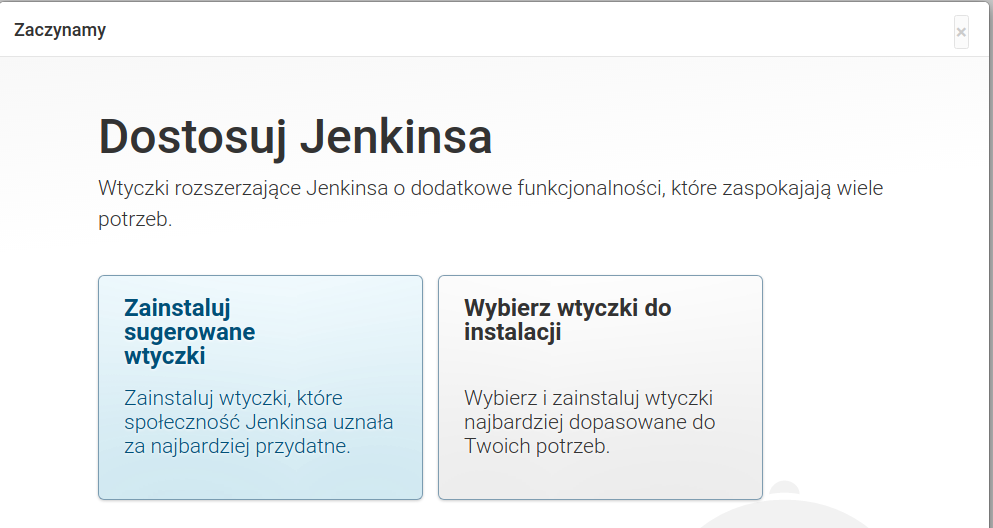

## [Materiały do pobrania](https://drive.google.com/drive/folders/1l8nAP_4hHqrliGPWCv8RHH6_SnM1-kA-?usp=sharing)
```
sha1sum
51bb48ecdfb4ce210f1941e43eebe674fb524b91  Jenkins_workshop_5.ova
3c6bff4eea93c387bbdf193015cda7c04833e75f  logger-plugin.hpi
a9fa67ec8bb023cf0d99eccd47b9cca96b433500  old-data-plugin.hpi
9d97f5492b3ba5c9cc502b3e26aa4b93a1c32ec5  old-data-plugin_v2.hpi
```
## Instalacja virtualnej maszyny
***Wymagania*** Zainstalowany [Virtual Box](https://www.virtualbox.org/wiki/Downloads)

W VM VirtualBox Manager wybieramy: Plik -> Importuj urządzenie wirtualne

W kolejnym oknie wybieramy pobrany obraz


W kolejnym oknie należy zwrócić uwagę na dwie opcje
* Ilość pamięci (jeżeli nie mamy za dużo to można zmniejszyć do 2G)
* Wybrać opcje: **Generate new MAC addresses ...**


Po zaimportowaniu i uruchomieniu powinniśmy otrzymać


Proszę, zwrócić uwagę na przydzielony adres IP powinien to być w waszej sieci, a nie adres localhost (127.0.0.1)!

Użytkownicy:
```
jenkins:12345678
root:12345678
```
Można się zalogować bezpośrednio w oknie powyżej lub uzywając putty lub innego kliennta ssh
(np git Bash)
```
ssh root@192.168.0.178
or
ssh jenkins@192.168.0.178
```
## 1: Uruchomienie 
### Instalacja via dnf
Definicja repozytorium i import klucza
```
# wget -O /etc/yum.repos.d/jenkins.repo https://pkg.jenkins.io/redhat/jenkins.repo
# rpm --import https://pkg.jenkins.io/redhat/jenkins.io.key
```
Instalacja
```
# dnf install jenkins
# dnf install java
```
Uruchomienie serwisu
```
# systemctl status jenkins.service
# systemctl enable jenkins.service
# systemctl start jenkins.service
```
Test: [http://192.168.0.178:8080/](http://192.168.0.178:8080/) otwieramy w przeglądarce

Firewall
```
# firewall-cmd --permanent --add-service=jenkins
# firewall-cmd --zone=public --add-service=http --permanent
# firewall-cmd --reload
# firewall-cmd --list-all
```
Test [http://192.168.0.178:8080/](http://192.168.0.178:8080/) otwieramy w przeglądarce

Usunięcie
```
# systemctl stop jenkins.service
# dnf remove jenkins
```
### Docker
```
$ docker pull jenkins/jenkins
# check version
$ docker image inspect docker.io/jenkins/jenkins
# start
$ docker run -d -v jenkins_home:/var/jenkins_home --name jenkins_workshop -p 8080:8080 -p 50000:50000 jenkins/jenkins &
$ docker ps
```
Test [http://192.168.0.178:8080/](http://192.168.0.178:8080/) otwieramy w przeglądarce
```
$ docker exec jenkins_workshop cat /var/jenkins_home/secrets/initialAdminPassword
```
Stop and clean
```
$ docker stop jenkins_workshop
$ docker rm jenkins_workshop
$ docker volume rm jenkins_home
```
### Uruchomienie via jar
```
$ cd /opt/tools/jenkins
$ java -jar jenkins.war &
```
Test [http://192.168.0.178:8080/](http://192.168.0.178:8080/) otwieramy w przeglądarce

Stop and clean
```
$ ps aux | grep java
$ kill -9 1338 #JENKINS_PID
# or
$ killall java

rm -rf ~/.jenkins
```
### Uruchomienie ze skryptu
```
$ cd /opt/tools/jenkins/
$ ls
jenkins.sh  jenkins.war  ssh
```
```
$ cat jenkins.sh 
#!/bin/bash

jh=/opt/tools/jenkins
jp=8080
mkdir -p $jh/log
mkdir -p $jh/war

command=$1

printUsage() {
    echo "Usage:"
    echo "jenkins.sh start"
    echo "jenkins.sh stop"
}

start() {
    jenkins_options="--logfile=$jh/log/jenkins.log --webroot=$jh/war"
    jenkins_options="$jenkins_options --ajp13Port=-1 --debug=5 \ 
                    --handlerCountMax=100 --handlerCountMaxIdle=20"
    
    #use http
    jenkins_options="$jenkins_options --httpPort=$jp"
    
    #use_https
    #jenkins_options="$jenkins_options --httpPort=-1 --httpsPort=8443 \ 
                       --httpsCertificate=$jh/ssh/cert.pem  \
                       --httpsPrivateKey=$jh/ssh/key.pem"

    java -Dcom.sun.akuma.Daemon=daemonized -Djava.awt.headless=true -DJENKINS_HOME=$jh \ 
         -jar $jh/jenkins.war $jenkins_options &
}

stop() {
    jenkinsPID=$(ps aux | grep java | grep $jh | awk '{print $2}')
    echo "kill jenkins process PID: "$jenkinsPID
    kill -9 $jenkinsPID 2>&1 > /dev/null
}

case $command in
    "start")
        start
        ;;
    "stop")
        stop
        ;;
    *)
        printUsage
esac

```
[winstone](http://winstone.sourceforge.net/), 
[winstone 1](http://winstone.sourceforge.net/#commandLine), 
[ajp](https://tomcat.apache.org/connectors-doc-archive/jk2/common/AJPv13.html), 
[headless](https://www.oracle.com/technical-resources/articles/javase/headless.html), 
[com.sun.akuma](https://github.com/kohsuke/akuma/tree/master/src/main/java/com/sun/akuma), 
[Jenkins initial-settings](https://www.jenkins.io/doc/book/installing/initial-settings/)
```
$ ./jenkins.sh
```
Test [http://192.168.0.178:8080/](http://192.168.0.178:8080/) otwieramy w przeglądarce
#### uruchomienie https
[ssl files explanation](https://serverfault.com/questions/9708/what-is-a-pem-file-and-how-does-it-differ-from-other-openssl-generated-key-file)
```
cd /opt/tools/jenkins/ssh
$ openssl genrsa -out key.pem
Generating RSA private key, 2048 bit long modulus (2 primes)
..............................................+++++
..............+++++
e is 65537 (0x010001)

$ openssl req -new -key key.pem -out csr.pem
You are about to be asked to enter information that will be incorporated
into your certificate request.
What you are about to enter is what is called a Distinguished Name or a DN.
There are quite a few fields but you can leave some blank
For some fields there will be a default value,
If you enter '.', the field will be left blank.
-----
Country Name (2 letter code) [XX]:PL
State or Province Name (full name) []:Lesser Poland
Locality Name (eg, city) [Default City]:KRK
Organization Name (eg, company) [Default Company Ltd]:K7Soft            
Organizational Unit Name (eg, section) []:
Common Name (eg, your name or your server's hostname) []:192.168.0.178
Email Address []:admin@k7soft.pl

Please enter the following 'extra' attributes
to be sent with your certificate request
A challenge password []:
An optional company name []:

#### Self-signed certificate ####
$ openssl x509 -req -days 9999 -in csr.pem -signkey key.pem -out cert.pem
Signature ok
subject=C = PL, ST = Lesser Poland, L = KRK, O = K7Soft, CN = 192.168.0.178, emailAddress = admin@k7soft.pl
Getting Private key
```
W ``jenkins.sh``
```
#use http
#jenkins_options="$jenkins_options --httpPort=$jp"

#use_https
jenkins_options="$jenkins_options --httpPort=-1 --httpsPort=8443 --httpsCertificate=$jh/ssh/cert.pem --httpsPrivateKey=$jh/ssh/key.pem"
```
A tu w logach
```
2020-10-30 11:55:00.779+0000 [id=1]     WARNING winstone.Logger#logInternal: Using the --httpsPrivateKey/--httpsCertificate 
options currently relies on unsupported APIs in the Oracle JRE.
Please use --httpsKeyStore and related options instead.
```
Create keystore
```
$ openssl pkcs12 -export -in cert.pem -inkey key.pem -out jenkins.p12 -name jenkins
Enter Export Password:
Verifying - Enter Export Password:

#Password: 12345678

$ keytool -importkeystore -deststorepass 12345678 -destkeypass 12345678 \
          -destkeystore jenkins.keystore -srckeystore jenkins.p12 \ 
          -srcstoretype PKCS12 -srcstorepass 12345678 -alias jenkins
Importing keystore jenkins.p12 to jenkins.keystore...

$ keytool -list -keystore jenkins.keystore 
Enter keystore password:  
Keystore type: PKCS12
Keystore provider: SUN

Your keystore contains 1 entry

jenkins, 30 paź 2020, PrivateKeyEntry, 
Certificate fingerprint (SHA-256): D9:9C:7F:85:C5:1C:D8:32:82:0A:70:8E:8E:CF:59:15:B9:22:A2:9B:5D:20:35:6E:44:D8:FE:D1:EA:15:0D:0E

```
Dodatkowo w ``jenkins.sh``
```
#jenkins_options="$jenkins_options --httpPort=-1 --httpsPort=8443 --httpsCertificate=$jh/ssh/cert.pem --httpsPrivateKey=$jh/ssh/key.pem"
jenkins_options="$jenkins_options --httpPort=-1 --httpsPort=8443 --httpsKeyStore=$jh/ssh/jenkins.keystore --httpsKeyStorePassword=12345678"
```
Firewall
```
## disabled
#
# systemctl status firewalld
# systemctl stop firewalld

## or open port
# firewall-cmd --get-active-zones
# firewall-cmd --permanent --zone=public --add-port=8443/tcp
# systemctl restart firewalld
```
### Ćwiczenie 1.1
[Uruchomienie ze skryptu](#uruchomienie-ze-skryptu)

### Ćwiczenie 1.2*
[Uruchamienie ze skryptu po https](#uruchomienie-https) 

W każdym przypadku powinniśmy otrzymać stronę startową

Hasło ze wskazanego pliku wklejamy w pole tekstowe
```
$ cat /opt/tools/jenkins/secrets/initialAdminPassword
```
Setup wizard


Jeżeli zamkniemy powyższe okno 


Ważne!
* Pominięto utworzenie konta administratora. Aby się zalogować, użyj loginu 'admin' i hasła użytego podczas konfigurowania Jenkinsa.
* Pominięto konfiguracje bazowego adresu URL Jenkinsa. Aby go skonfigurować, przejdź do strony "Zarządzaj Jenkinsem".

Instalujemy sugerowane wtyczki


Admin page

```
Login: admin
Hasło: 12345678
Pełna nazwa: Administrator
Adres email: admin@acme.com
```


## 2: Katalog domowy
### Instalacja via dnf
```
JENKINS_HOME=/var/lib/jenkins
logfile=/var/log/jenkins/jenkins.log
war=/usr/lib/jenkins/jenkins.war
```
### Instalacja via dnf
```
JENKINS_HOME=/home/jenkins/.jenkins
```
Struktura
```
├── config.xml              (jenkins root configuration)
├── *.xml                   (other site-wide configuration files)
├── jenkins.sh              (start stop script)
├── jenkins.war             (jenkins war :))
├── log                     (task log directory)
├── logs                    (logs)
├── nodes                   (nodes configuration)
├── plugins                 (stores plugins)
├── secrets                 (secretes needed when migrating credentials to other servers)
├── ssh                     (ssl configuration)
├── updates                 (updates config)
├── userContent             (files in this directory will be served under your http://server/userContent/)
├── users                   (users configuration)
│   ├── admin_4702638789067880202
│   └── users.xml
├── war                     (unpacked jenkins.war)
├── workflow-libs           (shared library)
├── jobs                    (jobs configuration and builds)
│   ├── Job A
│   │   ├── builds
│   │   │   ├── 1
│   │   │   │   ├── build.xml
│   │   │   │   ├── changelog.xml
│   │   │   │   └── log
│   │   │   ├── 2
│   │   │   │   ├── build.xml
│   │   │   │   ├── changelog.xml
│   │   │   │   └── log
│   │   │   ├── legacyIds
│   │   │   └── permalinks
│   │   ├── config.xml
│   │   └── nextBuildNumber
│   └── restCounter
│       ├── builds
│       │   ├── 1
│       │   │   ├── build.xml
│       │   │   └── log
│       │   ├── 2
│       │   │   ├── build.xml
│       │   │   ├── changelog.xml
│       │   │   ├── log
│       │   │   └── pl.klimas7$restCounter -> ../../modules/pl.klimas7$restCounter/builds/2
│       │   ├── 3
│       │   │   ├── build.xml
│       │   │   ├── changelog.xml
│       │   │   ├── log
│       │   │   └── pl.klimas7$restCounter -> ../../modules/pl.klimas7$restCounter/builds/3
│       │   ├── legacyIds
│       │   └── permalinks
│       ├── config.xml
│       ├── modules
│       │   └── pl.klimas7$restCounter
│       │       ├── builds
│       │       │   ├── 2
│       │       │   │   ├── archive
│       │       │   │   │   └── pl.klimas7
│       │       │   │   │       └── restCounter
│       │       │   │   │           └── 0.0.1-SNAPSHOT
│       │       │   │   │               ├── restCounter-0.0.1-SNAPSHOT.jar
│       │       │   │   │               └── restCounter-0.0.1-SNAPSHOT.pom
│       │       │   │   ├── build.xml
│       │       │   │   ├── junitResult.xml
│       │       │   │   └── log
│       │       │   ├── 3
│       │       │   │   ├── archive
│       │       │   │   │   └── pl.klimas7
│       │       │   │   │       └── restCounter
│       │       │   │   │           └── 0.0.1-SNAPSHOT
│       │       │   │   │               ├── restCounter-0.0.1-SNAPSHOT.jar
│       │       │   │   │               └── restCounter-0.0.1-SNAPSHOT.pom
│       │       │   │   ├── build.xml
│       │       │   │   ├── junitResult.xml
│       │       │   │   └── log
│       │       │   ├── legacyIds
│       │       │   └── permalinks
│       │       ├── config.xml
│       │       └── nextBuildNumber
│       └── nextBuildNumber
└── workspace               (working directory for the version control system)
    ├── Job A
    │   └── test_job_a.txt
    └── restCounter
        ├── pom.xml
        ├── README.md
        ├── restCounter.sh
        ├── src
        └── target
```
### 2.1 Ćwiczenie: Zmiana liczby egzekutorów
```
$ cd /opt/tools/jenkins/
$ vim config.xml
```
```xml
<?xml version='1.1' encoding='UTF-8'?>
<hudson>
  <disabledAdministrativeMonitors/>
  <version>2.235.5</version>
  <installStateName>RUNNING</installStateName>
  <numExecutors>4</numExecutors>                <!-- z 2 na 4 --> 
  <mode>NORMAL</mode>
  <useSecurity>true</useSecurity>
```
``Jenkins -> Zarządzaj Jenkinsem -> Odczytaj ponownie konfigurację z dysku``


vim: 
 * ``insert`` or ``i`` switch to insert mode
 * ``esc`` switch to command mode
 * ``:wq`` write and quit
 
### 2.2 Ćwiczenie: Odzyskanie dostępu
```
$ cd /opt/tools/jenkins/
$ ./jenkins.sh stop
$ vim config.xml
```
```xml
<hudson>
  <disabledAdministrativeMonitors/>
  <version>2.235.5</version>
  <installStateName>RUNNING</installStateName>
  <numExecutors>4</numExecutors>
  <mode>NORMAL</mode>
  <useSecurity>false</useSecurity>              <!-- z true na false -->
  <authorizationStrategy class="hudson.security.FullControlOnceLoggedInAuthorizationStrategy">
    <denyAnonymousReadAccess>true</denyAnonymousReadAccess>
  </authorizationStrategy>
```
```
$ ./jenkins.sh start
```
``Jenkins -> Zarządzaj Jenkinsem -> Konfiguruj ustawienia bezpieczeństwa``


``Jenkins -> Użytkownicy -> admin -> Konfiguracja``


### 2.3: Ćwiczenie* UserContent
``Jenkins -> Nowy Projekt -> Ogólny projekt (nazwa UserContent) -> OK``


``Budowanie -> Dodaj krok budowania -> Uruchom powłokę``


``echo "Test" > ../../userContent/${BUILD_TAG}.txt``

Wynik [http://192.168.0.178:8080/userContent/](http://192.168.0.178:8080/userContent/)


Udostępnianie 'linków'
```
$ cd /opt/tools/jenkins/
$ ln -s /opt/tools/maven userContent/maven
```


[System Properties](https://www.jenkins.io/doc/book/managing/system-properties/)
```
$ ./jenkins.sh stop
$ vim jenkins.sh
```
```
    java_options="-Dhudson.model.DirectoryBrowserSupport.allowSymlinkEscape=true"
    java -Dcom.sun.akuma.Daemon=daemonized -Djava.awt.headless=true -DJENKINS_HOME=$jh $java_options -jar $jh/jenkins.war $jenkins_options &
```
```
$ ./jenkins.sh start
```


## 3: Aktualizacja i instalacja wtyczek
Aktualizacja Jenkinsa - dostępna ze strony głównej


lub ``Jenkins -> Zarządzaj Jenkinsem``


Powrót do poprzedniej wersji ``Jenkins -> Zarządzaj Jenkinsem``


Aktualizacja wtyczek ``Menedżer wtyczek`` ``Jenkins -> Zarządzaj Jenkinsem -> Zarządzaj wtyczkami``


Instalacja wtyczek z poza repozytorium
``Jenkins -> Zarządzaj Jenkinsem -> Zarządzaj wtyczkami`` ``Menedżer wtyczek -> Zaawansowane``


### Ćwiczenie 3.1: Aktualizacja
Zainstaluj aktualizacje Jenkinsa, pluginów oraz 2 pluginy z poza repozytorium
```
logger-plugin.hpi
old-data-plugin.hpi
``` 
## 4: Status Information
### 4.1: Ćwiczenie
Tworzymy 4 projekty (joby)
``Jenkins -> Nowy Projekt -> Ogólny projekt (JobShedule[1..4])``  
Opcje
* Wykonuj zadania współbieżnie, jeśli zajdzie potrzeba
* Buduj cyklicznie ``* * * * *`` (co minute)
* ``Budowanie -> Uruchom powłoke``
```
random=$(( ( RANDOM % 70 )  + 1 ))
echo "Job sleep $random"
sleep $random
```

Kolejne 3 można stworzyć używając funkcji ``Kopiuj z``
``Jenkins -> Nowy Projekt -> Kopiuj z``


### 4.2: Informacje o systemie
Dostępne informacje:
* jvm properties
* system properties
* plugin version
* Memory Usage (new!)
* Thread dump

### 4.3: Informacje o Jenkinsie
Dostępne informacje:
* Zewnętrzne biblioteki oraz ich licencje
* Statyczne zasoby
* Wtyczki i ich licencje

### 4.4: Statystyki obciążenia
### 4.5: Dziennik systemowy
Źródła wtyczki [logger-plugin](https://github.com/klimas7/logger-plugin)
#### 4.5.1: Ćwiczenie
Towrzymy projekt ogólny ``Logger`` w którym użyjemy kroku budowania ``Logger example``  
``Jenkins -> Nowy Projekt -> Ogólny projekt (Logger)``  
``Budowanie -> Logger example``  
  
Zapisz, Uruchom  
Sprawdzamy co otrzymaliśmy w logach  
``Jenkins -> Zarządzaj Jenkinsem -> Dziennik systemwy -> Wszystkie zdarzenia Jenkinsa``  
  
```
lis 13, 2020 6:24:18 PM INFO io.jenkins.plugins.LoggerBuilder printLog
Log: INFO code: 800
lis 13, 2020 6:24:18 PM SEVERE io.jenkins.plugins.LoggerBuilder printLog
Log: SEVERE code: 1000
lis 13, 2020 6:24:18 PM WARNING io.jenkins.plugins.LoggerBuilder printLog
Log: WARNING code: 900
```
Dodanie dedykowanego loggera
``Jenkins -> Zarządzaj Jenkinsem -> Dziennik systemwy -> Dodaj nowy rejestrator logów``  
Nazwa: ``Logger``  
  
Loggers: ``Logger: io.jenkins.plugins`` ``Log level: ALL``  
   
Save, Uruchom ponownie projet ``Logger`` w nowo dodanym logerze  
```
lis 13, 2020 6:42:06 PM ALL io.jenkins.plugins.LoggerBuilder
Log: ALL code: -2147483648
lis 13, 2020 6:42:06 PM CONFIG io.jenkins.plugins.LoggerBuilder
Log: CONFIG code: 700
lis 13, 2020 6:42:06 PM FINE io.jenkins.plugins.LoggerBuilder
Log: FINE code: 500
lis 13, 2020 6:42:06 PM FINER io.jenkins.plugins.LoggerBuilder
Log: FINER code: 400
lis 13, 2020 6:42:06 PM FINEST io.jenkins.plugins.LoggerBuilder
Log: FINEST code: 300
lis 13, 2020 6:42:06 PM INFO io.jenkins.plugins.LoggerBuilder printLog
Log: INFO code: 800
lis 13, 2020 6:42:06 PM SEVERE io.jenkins.plugins.LoggerBuilder printLog
Log: SEVERE code: 1000
lis 13, 2020 6:42:06 PM WARNING io.jenkins.plugins.LoggerBuilder printLog
Log: WARNING code: 900
```

## 5: Troubleshooting
```Jenkins -> Zarządzaj Jenkinsem -> Troubleshooting -> Zarządzanie starymi danymi```  
Mechanizm zabezpieczający Jenkinsa przed zmiananmi w konfiguracji np. wtyczek. Administrator powinien świadomie przeglądnąć zmiany i ewentualnie podjąć odpowiednie działania.
* wyciszyć powiadomienie.
* przywrócić poprzednią wersje wtyczki (jenkinsa)  

  
Przykład zmian w pluginie: 
Źródła wtyczki [OldDataPlugin](https://github.com/klimas7/OldDataPlugin/commits/master)  
Towrzymy projekt ogólny ``OldData`` w którym użyjemy kroku budowania ``Old Data``  
``Jenkins -> Nowy Projekt -> Ogólny projekt (OldData)``  
``Budowanie -> Old Data`` ``First, Second `` mogą być dowolne  
  
Save, Uruchom  
```
Uruchomiono przez użytkownika Administrator
Running as SYSTEM
Building in workspace /opt/tools/jenkins/workspace/OldData
First: One Second: Two
Finished: SUCCESS
```
Instalujemy kolejną wersje plugina oldData ``old-data-plugin_v2.hpi`` [Materiały](#materiay-do-pobrania)  
``Jenkins -> Zarządzaj Jenkinsem -> Zarządzaj wtyczkami -> Zawansowane -> Prześlij wtyczkę (old-data-plugin_v2.hpi)``  
  
Restart  
  
  
### 5.1: Ćwiczenie Wykonać powyższy przkład
## X 6: Skonfiguruj system
## X 7: Globalne narzędzia do konfiguracji
## X 8: Zarządzanie węzłami (nodes)
## X 9: Konfiguruj ustawienia bezpieczeństwa 
## X 10: Konsola skryptow
## X 11: CLI
## X 12: Rest and xml api
## X 13: Ogólny projekt (Freestyle project)
## X 14: Maven project
## 15: Pipelines
Start:
* http://{jenkins_host}:{jenkins_port}/job/{job_name}/pipeline-syntax/
* https://www.jenkins.io/doc/book/pipeline/

### 15.1: Ćwiczenie, Zainstalować wtyczki ``Blue Ocean (BlueOcean Aggregator)`` 
### 15.2: Scripted vs Declarative Pipeline
### 15.y: In-process Script Approval
### 15.z: Walidation
```
ssh -l admin -p 8081 localhost declarative-linter < Jenkinsfile
```
## 16: Shared Library
Pozwalają wyodrębnić oraz wspódzielić wspólne części pomiędzy wieloma potokami. Elementy takie mogą być zamknięte w bibiotece 
przechowywanej w repozytorium kodu.

Strktura
```
├── README.md
├── src                                 (Groovy source files)
│   └── pl
│       └── klimas7
│           └── jenkins
│               ├── Deployer.groovy
│               └── Rectangle.groovy
├── vars                                (Exposed variables)
│   ├── checkStatus.groovy
│   ├── deploy.groovy
│   ├── disableThrottling.groovy
│   ├── enableThrottling.groovy
│   └── printBuildinfo.groovy
└── resources                           (resource files)
    └── pl
        └── klimas7
            └── jenkins
                └── static_content.json
    
```
``src`` Standardowy katalog znany z projektów javy. Jest dodawany do classpath w trakcie wykonania potoku  
``vars`` Definicje zmiennych ktore są dostępne w potoku  
Przykład [jenkins-shared-lib](https://github.com/klimas7/jenkins-shared-lib)  
Dodanie nowej bibliotegi do Jenkinsa  
``Jenkins -> Zarządzaj Jenkinsem -> Skonfiguruj system -> Global Pipeline Libraries``
  
* Name: jenkins-shared-lib
* Default version: master
* Retrieval method: Modern SCM
* Select the Git type
* Project repository: https://github.com/klimas7/jenkins-shared-lib.git
* Credentials: (leave blank)

Nowy projekt wykorzystujący przygotowaną bibliotekę  
``Jenkins -> Nowy Projekt -> Pipeline (JenkinsSharedLib)``  
Proste wykorzystanie
```
@Library('jenkins-shared-lib')_

stage('Print Build Info') {
    printBuildinfo {
        name = "Sample Name"
    }
} stage('Disable throttling') {
    disableThrottling()
} stage('Deploy') {
    deploy()
} stage('Enable throtling') {
    enableThrottling()
} stage('Check Status') {
    checkStatus()
}
```
Hint! ``@Library('jenkins-shared-lib')_`` ``_`` nie jest pomyłką  
Przykład z parametrami
```
@Library('jenkins-shared-lib')_

pipeline {
    parameters {
        string defaultValue: 'One default', description: '', name: 'param1', trim: false
        string defaultValue: 'Two default', description: '', name: 'param2', trim: false
    }
    agent any
    
    stages {
        stage('Print Build Info') {
            steps {
                script {
                    printBuildinfo {
                        name = "Sample Name"
                    }
                }
            }
        }
        stage('Disable throttling') {
            steps {
                script {
                    disableThrottling()
                }
            }
        }
        stage('Deploy') {
            steps {
                script { 
                    deploy()
                }
            }
        }
        stage('Enable throtling') {
            steps {
                script {
                    enableThrottling()
                }
            }
        }
        stage('Check Status') {
            steps {
                script {
                    checkStatus()
                }
            }
        }
    }
}
```
### 16.1: Ćwiczenie 
Wykorzystać przygotowaną bibliotekę w przykładowym potoku, prosty skrypt bez parametrow
### 16.2: Ćwiczenie*
Wykorzystać przygotowaną bibliotekę w przykładowym potoku, pełen skrypt z użyciem konwencji potoku i parametrow
## X 17: Bitbucket integration
## Koniec